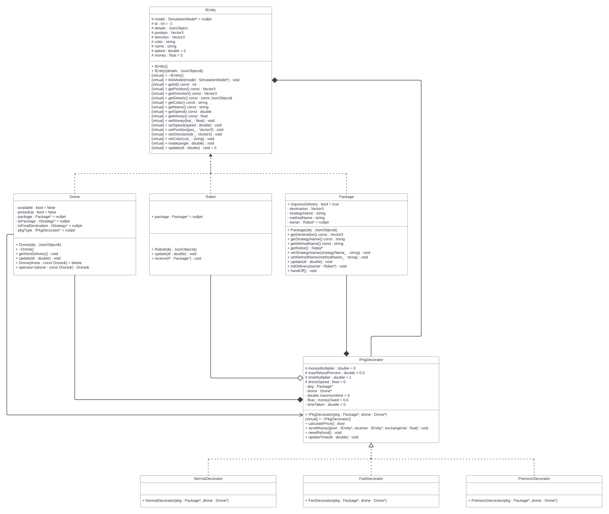

# CSCI 3081W Drone Delivery Project
Team number: Team-010-04<br>
Team members: MJ Corey & Randy Tan<br>
x500's: corey094 & tan00225<br>

# Youtube Feature Demonstration

https://youtu.be/WwbbFUHoKR8

## Project description

This project is a simulation that emulates the University of Minnesota - Twin Cities campus as its scope. The simulation emulates a drone delivery system that will deliver packages from a start to end point at a user's request.

#### Docker Pre-requisites
  * Install [Windows Docker](https://docs.docker.com/desktop/install/windows-install/)
  * Install [macOS (Apple Silicon & Intel) Docker](https://docs.docker.com/desktop/install/mac-install/)
  * Install [Linux Docker](https://docs.docker.com/desktop/install/linux-install/)

## How to run via Docker:
1. In terminal run the command line below, taken from https://hub.docker.com/r/tan00225/drone_sim
    ```bash
    docker pull tan00225/drone_sim
    ```
2. Then run,
   ```bash
   docker ps
   ```

   Delete all CONTAINER ID's that correlates with the port of "0.0.0.0:8081->8081/tcp" by:

   ```bash
   docker kill <CONTAINER ID>
   ```

   Finally, try to execute the run command again:
   ```bash
    docker run --rm -it -p 8081:8081 tan00225/drone_sim
    ```

3. Open browser and navigate to 
    ```bash
    127.0.0.1:8081/
    ```
    or
    ```bash
    localhost:8081
    ```

## How to run via CSE lab machines: 
    
1. SSH into a CSE Lab Machine with port forwarding for the UI
   **Note:** If port 8081 is not available, choose a different port (8082, 8083, 8084, etc.)

2.  ```bash
    ssh -L 8081:127.0.0.1:8081 x500@csel-kh1250-05.cselabs.umn.edu
    ```

3.  ```bash
    git clone https://github.umn.edu/umn-csci-3081-f23/team-010-04-hw4
    ```

4. Compile the project by:
    ```bash
    cd /path/to/cloned/repo
    ```
   Next, do:
    ```bash
    make clean
    ```
   After that, invoke: 
    ```bash
    make -j
    ```

5. To create a runnable version of the simulation, call 
    ```bash
    ./build/bin/transit_service xxxx apps/transit_service/web/
    ```
   where xxxx is an arbitrary selected port by the user. 

6. Open the page with the selected port in the xxxx spot. 
    ```bash
    127.0.0.1:xxxx 
    ```
   To schedule a delivery in the simulation, select the 'Schedule Page' button on the right side of the screen. Choose your options for the delivery and select a starting and finishing location for it on the map.

## Specific Function:
 A user will place two nodes indicating a starting position of the delivery to the final destination. The drone will deliver packages from the first placed node to a robot at the final node placed. The drone will then use common search algorithms (Depth First Search, Breadth First Search, A*, and Dijkstra) on points placed on the map to maneuver the drone from the package to the robot. The drone will then move using positioning on the map, a speed value, and a change in time based on how fast the simulation is running.

## New features:
 This version of the simulation added package delivery types. As of this release, there are three types of package delivery: Normal, Fast, and Premium. These three package delivery types coincide with the other new feature: Entity Money. Each entity is now capable of holding money as a new private member variable created on initialization. The robots that receive the package will send some amount of money to the drone that did the delivery. The amount of money spent is based on the distance (as the crow flies) of the delivery from package to robot and the type of delivery.

 To implement this, our team used a decorator strategy to decorate packages with a new class called an IPkgDecorator. This class contains the logic to calculate prices based on the delivery type, pay the drone money from the robot, make the drone move faster or slower depending on delivery type, refuse to make trips if the robot does not have sufficient funds, and refund the robot some amount of money if the delivery takes longer than expected.

## Using the new feature:
 To use the new feature, simply select the type of delivery method that you would like on the schedule delivery page. The default is normal delivery, so the feature will be in use for any given delivery. To test all the given features, we recommend trying to make a premium delivery from one corner of the map to the opposite on the diagonal. The robot will not likely have enough money to buy this delivery, and nothing will happen. To test the refund method, we suggest using a suboptimal pathing algorithm, such as DFS, to deliver a long-distance package.

## Project Sprint Retrospective:
 The sprints done in this project were definitely a good learning experience for the entire team. It was good to have certain features be done by a certain date; however, there was still a lot the team could have learned. For example, the first scrum contained features such as adding money logic to entities on the map and adjusting the front end for a new dropdown, whereas the second scrum had implementation of the new class feature. The workload of the two scrums was not equal and led to the second sprint being much more stressful than the first. In future projects, the team will be looking to allocate the workload in separate scrums better.

## UML Diagram

